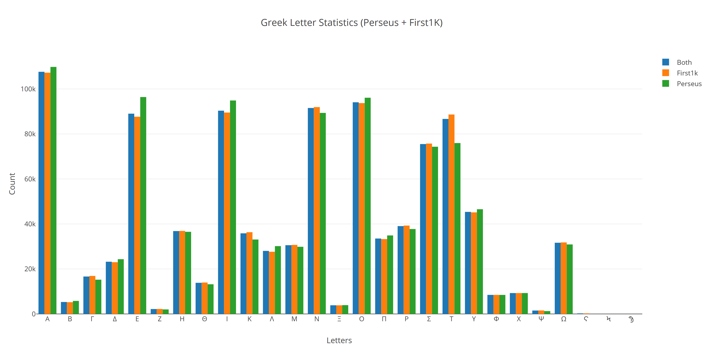

Processing Greek corpora for the riddle solver
==============================================

   Michelangelo's Delphic Sibyl, Sistine Chapel

Pseudo-Sibylline oracles contain hexametric poems written in Ancient Greek.
These *oracula* were mainly composed in 150BC - 200AD to twelve different extant
books. They were circulating and quite famous among the Judaeo-Christian
community at that time. They shouldn't, however, be too much confused with the
earlier `Sibylline books <https://en.wikipedia.org/wiki/Sibylline_Books>`__.
Sibylline books contained religious ceremonical advices that were consulted by
the selected priests and curators in the Roman empire, when it was in deep
political trouble. The collection of the original Sibylline books were destroyed
by different accidental events and deliberate actions in history.

Pseudo-Sibylline oracles, on the other hand, contain Jewish narrative of the
human history contrasted to the Greek mythology and to the chronology of the
great ancient empires. Other intention of the material is to support Christian
doctrine and interpretation of the prophesies. Prophesies were mostly grounded
on Jewish literature, but surprisingly some pagan events also came to be
interpreted as signs of the coming Messiah.

Some of the material in the Pseudo-Sibylline oracles contain cryptic puzzles,
often referring to persons, cities, countries, and epithets of God for example.
These secretive references are often very general in nature, pointing only to
the first letter of the subject and its numerical value. Solving them requires
a proper knowledge of the context, not only inner textual but historical context.

Most of the alphanumeric riddles in the oracles have been solved by researchers
already. Some of the riddles are still problematic and open for better proposals.
Better yet, few of these open riddles are specific enough so that one may try
to solve them by modern programmable tools.

Natural language processing
~~~~~~~~~~~~~~~~~~~~~~~~~~~

Programmatical approach to solve the riddles requires huge Greek text corpora.
Bigger it is, the better. I will download and preprocess available open source
Greek corpora, which is a quite daunting task for many reasons. I have left the
most of the details of this part for the enthusiasts to read straight from the
code and its comments:
https://github.com/markomanninen/grcriddles/blob/master/functions.py.
In the end, I'll have a word database containing hundreds of thousands of unique
Greek words extracted from the naturally written language corpora. Then words
can be further used in the riddle solver.

Note that rather than just reading, this, and the following chapters can
also be run interactively in your local `Jupyter <https://jupyter.org/>`__
notebook installation if you prefer. That means that you may verify the
procedure or alter parameters and try solving the riddles with your own
parameters.

Your can download these independent Jupyter notebooks from:

-  Processing Greek corpora:
   `https://github.com/markomanninen/grcriddles/blob/master/processing.ipynb
   <https://github.com/markomanninen/grcriddles/blob/master/processing.ipynb>`__
-  Riddle solver:
   `https://github.com/markomanninen/grcriddles/blob/master/solver.ipynb
   <https://github.com/markomanninen/grcriddles/blob/master/solver.ipynb>`__

Collecting Greek Corpora
~~~~~~~~~~~~~~~~~~~~~~~~

The first task is to get a big raw ancient Greek text to operate with.
`CLTK <https://github.com/cltk/cltk>`__ library provides an importer to the
`Perseus <http://www.perseus.tufts.edu/hopper/opensource/download>`__ and the
`First1KGreek <http://opengreekandlatin.github.io/First1KGreek/>`__ open source
data sources.

I'm using `Abnum <https://github.com/markomanninen/abnum3>`__ library to strip
accents of the Greek words, remove non-alphabetical characters, as well as
calculating the isopsephical value of the words.
`Greek_accentuation <https://github.com/jtauber/greek-accentuation>`__ library
is used to split words into syllables. This is required because few of the
riddles contain specific information about syllables of the word.
`Pandas <http://pandas.pydata.org/>`__ library is used as an API to the
collected database. `Plotly <https://plot.ly/>`__ library and online infographic
service are used for the visual presentation of the statistics.

You can install these libraries by uncommenting and running the next install
lines:

.. code-block:: python

	import sys

	#!{sys.executable} -m pip install cltk abnum
	#!{sys.executable} -m pip install pandas plotly
	#!{sys.executable} -m pip install greek_accentuation

For your convenience, my environment is the following:

.. code-block:: python

	print("Python %s" % sys.version)

Output:

.. code-block:: txt

    Python 3.6.1 | Anaconda 4.4.0 (64-bit)| (default, May 11 2017, 13:25:24)
    [MSC v.1900 64 bit (AMD64)]

Note that `Python 3.4+` is required for all examples to work properly.

Listing CLTK corpora
~~~~~~~~~~~~~~~~~~~~

Let's see what corpora are available for download:

.. code-block:: python

	from cltk.corpus.utils.importer import CorpusImporter
	corpus_importer = CorpusImporter('greek')
	', '.join(corpus_importer.list_corpora)

Output:

.. code-block:: txt

  greek_software_tlgu, greek_text_perseus, phi7, tlg, greek_proper_names_cltk,
	greek_models_cltk, greek_treebank_perseus, greek_lexica_perseus,
	greek_training_set_sentence_cltk, greek_word2vec_cltk,
	greek_text_lacus_curtius, greek_text_first1kgreek

I'm going to use `greek_text_perseus` and `greek_text_first1kgreek` corpora for
the study by combining them into a single raw text file and unique words
database.

Downloading corpora
~~~~~~~~~~~~~~~~~~~

The next code snippet will download hundreds of megabytes of Greek text to your
local computer for quicker access:

.. code-block:: python

	for corpus in ["greek_text_perseus", "greek_text_first1kgreek"]:
	    try:
	        corpus_importer.import_corpus(corpus)
	    except Exception as e:
	        print(e)

Next, I will copy only suitable greek text files from `greek_text_first1kgreek`
to the working directory `greek_text_tlg`.

Note that you can download and extract `greek_text_first1kgreek` directly from
https://github.com/OpenGreekAndLatin/First1KGreek/zipball/master. It may have
the most recent and complete set of files. If you wish to use it, extract
package directly to `~\cltk_data\greek\text\greek_text_first1kgreek`.

I have collected the large part of the used procedures to the `functions.py
<https://github.com/markomanninen/grcriddles/blob/master/functions.py>`__ script
to maintain this document more concise.

.. code-block:: python

	from functions import path, joinpaths, copy, dirt

	# copy all suitable greek text files from the source dir to the destination work dir
	if not path.isdir(path.join(dirt, "greek_text_tlg")):
	    source = joinpaths(dirt, ["greek_text_first1kgreek", "data"])
	    destination = joinpaths(dirt, ["greek_text_tlg"])
	    print("Copying %s -> %s" % (source, destination))
	    try:
	        copy(source, destination)
	    except Exception as e:
	        print(e)
	else:
	    print(path.join(dirt, "greek_text_tlg"), "already exists, lets roll on!")

Output:

.. code-block:: txt

    C:\Users\marko\cltk_data\greek\text\greek_text_tlg already exists, lets
    roll on!

Perseus corpora are pretty good as they are. However, Perseus Greek source text
is written as a `betacode <https://en.wikipedia.org/wiki/Beta_Code>`__, so I
need a converter script for it. I found a suitable one from Python `hexameter
<https://github.com/epilanthanomai/hexameter>`__ GitHub repository but had to
make a small fix to it, so I'm using my own version of the `betacode.py
<https://github.com/markomanninen/grcriddles/blob/master/betacode.py>`__ script.

Processing files
~~~~~~~~~~~~~~~~

Next step is to find out Greek text nodes from the provided XML source files. I
had to specify a tag table to find main text lines from the source files so
that only Greek texts are processed. XML files have a lot of meta information
and text blocks written for example in English and Latin that needs to be
stripped out.

Extracted content is saved to the author/work based work directories. Simplified
uncial conversion is also made at the same time so that the final output file
contains only plain uppercase words separated by spaces. Pretty much in a format
written by the ancient Greeks btw. Noteworth is that stored words are not stems,
or word roots but contain words in all possible prefixes and affixes,
i.e. inflected forms.

Collecting text files
~~~~~~~~~~~~~~~~~~~~~

.. code-block:: python

	from functions import init_corpora

	# init corpora list
	corpora = ["greek_text_perseus", "greek_text_tlg"]

	greek_corpora_x = init_corpora(corpora)
	print("%s files found" % len(greek_corpora_x))

Output:

.. code-block:: text

    1272 files found

Process text files
~~~~~~~~~~~~~~~~~~

This will take several minutes depending on if you have already run it once and
have temporary directories available. Old processed corpora files are removed
first, then they are recreated by calling `process_greek_corpora` function.

.. code-block:: python

	from functions import remove, all_greek_text_file, perseus_greek_text_file, first1k_greek_text_file, process_greek_corpora

	# remove old processed temporary files
	try:
	    remove(all_greek_text_file)
	    remove(perseus_greek_text_file)
	    remove(first1k_greek_text_file)
	except OSError:
	    pass

	# collect greek corpora data
	greek_corpora = process_greek_corpora(greek_corpora_x)

Statistics
----------

When files are downloaded and preprocessed, I can get the size of the text files:

.. code-block:: python

	from functions import get_file_size

	print("Size of the all raw text: %s MB" % get_file_size(all_greek_text_file))
	print("Size of the perseus raw text: %s MB" % get_file_size(perseus_greek_text_file))
	print("Size of the first1k raw text: %s MB" % get_file_size(first1k_greek_text_file))

Output:

.. code-block:: txt

    Size of the all raw text: 604.88 MB
    Size of the perseus raw text: 79.74 MB
    Size of the first1k raw text: 525.13 MB

I will calculate other statistics of the saved text files to compare their
content:

.. code-block:: python

	from functions import get_stats

	ccontent1, chars1, lwords1 = get_stats(perseus_greek_text_file)
	ccontent2, chars2, lwords2 = get_stats(first1k_greek_text_file)
	ccontent3, chars3, lwords3 = get_stats(all_greek_text_file)

Output:

.. code-block:: txt

    Corpora: perseus_greek_text_files.txt
    Letters: 38146511
    Words in total: 7322673
    Unique words: 355348

    Corpora: first1k_greek_text_files.txt
    Letters: 249255721
    Words in total: 52130741
    Unique words: 648873

    Corpora: all_greek_text_files.txt
    Letters: 287402232
    Words in total: 59453414
    Unique words: 826516

Letter statistics
~~~~~~~~~~~~~~~~~

I'm using `DataFrame` object from `Pandas` library to handle tabular data and
show basic letter statistics for each corpora and combination of them. Native
`Counter` object in Python is used to count unique elements in the given
sequence. Sequence in this case is the raw Greek text stripped from all special
characters and spaces, and elements are the letters of the Greek alphabet.

This will take some time to process too:

.. code-block:: python

  from functions import Counter, DataFrame
	# perseus dataframe
	df = DataFrame([[k, v] for k, v in Counter(ccontent1).items()])
	df[2] = df[1].apply(lambda x: round(x*100/chars1, 2))
	a = df.sort_values(1, ascending=False)
	# first1k dataframe
	df = DataFrame([[k, v] for k, v in Counter(ccontent2).items()])
	df[2] = df[1].apply(lambda x: round(x*100/chars2, 2))
	b = df.sort_values(1, ascending=False)
	# perseus + first1k dataframe
	df = DataFrame([[k, v] for k, v in Counter(ccontent3).items()])
	df[2] = df[1].apply(lambda x: round(x*100/chars3, 2))
	c = df.sort_values(1, ascending=False)

Show letter statistics
~~~~~~~~~~~~~~~~~~~~~~

The first column is the letter, the second column is the count of the letter,
and the third column is the percentage of the letter contra all letters.

.. code-block:: python

	from functions import display_side_by_side
  # show tables side by side to save some vertical space
	display_side_by_side(Perseus=a, First1K=b, Perseus_First1K=c)

**Perseus**

| Letter | Count | Percent |
| --- | --- | --- |
| Α | 4182002 | 10.96 |
| Ε | 3678672 | 9.64 |
| Ο | 3664034 | 9.61 |
| Ι | 3613662 | 9.47 |
| Ν | 3410850 | 8.94 |
| Τ | 2903418 | 7.61 |
| Σ | 2830967 | 7.42 |
| Υ | 1776871 | 4.66 |
| Ρ | 1440852 | 3.78 |
| Η | 1392909 | 3.65 |
| Π | 1326596 | 3.48 |
| Κ | 1261673 | 3.31 |
| Ω | 1179566 | 3.09 |
| Λ | 1147548 | 3.01 |
| Μ | 1139510 | 2.99 |
| Δ | 932823 | 2.45 |
| Γ | 584668 | 1.53 |
| Θ | 501512 | 1.31 |
| Χ | 352579 | 0.92 |
| Φ | 325210 | 0.85 |
| Β | 220267 | 0.58 |
| Ξ | 152971 | 0.40 |
| Ζ | 75946 | 0.20 |
| Ψ | 51405 | 0.13 |

**First1K**

| Letter | Count | Percent |
| --- | --- | --- |
| Α | 26817705 | 10.76 |
| Ο | 23687669 | 9.50 |
| Ι | 22665483 | 9.09 |
| Ν | 22498413 | 9.03 |
| Ε | 22121458 | 8.88 |
| Τ | 21698265 | 8.71 |
| Σ | 18738234 | 7.52 |
| Υ | 11384921 | 4.57 |
| Ρ | 9776411 | 3.92 |
| Η | 9268111 | 3.72 |
| Κ | 8982955 | 3.60 |
| Π | 8290364 | 3.33 |
| Ω | 7874161 | 3.16 |
| Μ | 7498489 | 3.01 |
| Λ | 6929170 | 2.78 |
| Δ | 5757782 | 2.31 |
| Γ | 4197053 | 1.68 |
| Θ | 3440599 | 1.38 |
| Χ | 2294905 | 0.92 |
| Φ | 2115768 | 0.85 |
| Β | 1322737 | 0.53 |
| Ξ | 951076 | 0.38 |
| Ζ | 559728 | 0.22 |
| Ψ | 375266 | 0.15 |
| Ϛ | 8430 | 0.00 |
| Ϡ | 364 | 0.00 |
| Ϟ | 204 | 0.00 |

**Both**

| Letter | Count | Percent |
| --- | --- | --- |
| Α | 30999707 | 10.79 |
| Ο | 27351703 | 9.52 |
| Ι | 26279145 | 9.14 |
| Ν | 25909263 | 9.01 |
| Ε | 25800130 | 8.98 |
| Τ | 24601683 | 8.56 |
| Σ | 21569201 | 7.50 |
| Υ | 13161792 | 4.58 |
| Ρ | 11217263 | 3.90 |
| Η | 10661020 | 3.71 |
| Κ | 10244628 | 3.56 |
| Π | 9616960 | 3.35 |
| Ω | 9053727 | 3.15 |
| Μ | 8637999 | 3.01 |
| Λ | 8076718 | 2.81 |
| Δ | 6690605 | 2.33 |
| Γ | 4781721 | 1.66 |
| Θ | 3942111 | 1.37 |
| Χ | 2647484 | 0.92 |
| Φ | 2440978 | 0.85 |
| Β | 1543004 | 0.54 |
| Ξ | 1104047 | 0.38 |
| Ζ | 635674 | 0.22 |
| Ψ | 426671 | 0.15 |
| Ϛ | 8430 | 0.00 |
| Ϡ | 364 | 0.00 |
| Ϟ | 204 | 0.00 |

`First1K` corpora contains mathematical texts in Greek, which explains why the
rarely used digamma (Ϛ = 6), qoppa (Ϟ/Ϙ = 90), and sampi(Ϡ = 900) letters are
included on the table. You can find other interesting differences too, like the
occurrence of E/T, K/Π, and M/Λ, which are probably explained by the difference
of the included text genres in the corporas.

Plotly bar chart for letter stats
~~~~~~~~~~~~~~~~~~~~~~~~~~~~~~~~~

The next chart will show visually which are the most used letters and the least
used letters in the available Ancient Greek corpora.

Vowels with `N`, `S`, and `T` consonants pops up as the most used letters. The
least used letters are `Z`, `Chi`, and `Psi`.

Uncomment next part to output a new fresh graph from Plotly:

.. code-block:: python

  #from plotly.offline import init_notebook_mode
  #init_notebook_mode(connected=False)

  # for the fist time set plotly service credentials, then you can comment the next line
  #import plotly
  #plotly.tools.set_credentials_file(username='MarkoManninen', api_key='xyz')

  # use tables and graphs...
  #import plotly.tools as tls
  # embed plotly graphs
  #tls.embed("https://plot.ly/~MarkoManninen/8/")

Then it is time to store unique Greek words to the database and show some
specialties of the word statistics. This will take a minute or two:

.. code-block:: python

  from functions import syllabify, Abnum, greek

  # greek abnum object for calculating isopsephical value
  g = Abnum(greek)

  # lets count unique words statistic from the parsed greek corpora rather than the plain text file
  # it would be pretty dauntful to find out occurence of the all 800000+ unique words from the text
  # file that is over 600 MB big!
  unique_word_stats = {}
  for item in greek_corpora:
      for word, cnt in item['uwords'].items():
          if word not in unique_word_stats:
              unique_word_stats[word] = 0
          unique_word_stats[word] += cnt

  # init dataframe
  df = DataFrame([[k, v] for k, v in unique_word_stats.items()])
  # add column for the occurrence percentage of the word
  df[2] = df[1].apply(lambda x: round(x*100/lwords1, 2))
  # add column for the length of the word
  df[3] = df[0].apply(lambda x: len(x))
  # add isopsephy column
  df[4] = df[0].apply(lambda x: g.value(x))
  # add syllabified column
  df[5] = df[0].apply(lambda x: syllabify(x))
  # add length of the syllables column
  df[6] = df[5].apply(lambda x: len(x))

Save unique words database
~~~~~~~~~~~~~~~~~~~~~~~~~~

This is the single most important part of the document. I'm saving all
simplified unique words as a csv file that can be used as a database for the
riddle solver. After this you may proceed to the `riddle solver
<Isopsephical riddles in the Greek Pseudo Sibylline hexameter poetry.ipynb>`__
Jupyter notebook document in interactive mode if you prefer.

.. code-block:: python

  from functions import csv_file_name, syllabify, Abnum, greek
  df.to_csv(csv_file_name, header=False, index=False, encoding='utf-8')

For confirmation, I will show five of the most repeated words in the database:

.. code-block:: python

  from functions import display_html
  # use to_html and index=False to hide index column
  display_html(df.sort_values(1, ascending=False).head(n=5).to_html(index=False), raw=True)

=====  =========  =========
 Word   Count      Percent
=====  =========  =========
 ΚΑΙ    3332509    45.51
 ΔΕ     1355091    18.51
 ΤΟ     1297764    17.72
 ΤΟΥ    933432     12.75
 ΤΩΝ    918946     12.55
=====  =========  =========

KAI...

For curiosity, let's also see the longest words in the database:

.. code-block:: python

  from functions import HTML
  l = df.sort_values(3, ascending=False).head(n=20)
  HTML(l.to_html(index=False))

| 0 | 1 | 2 | 3 | 4 | 5 | 6 |
| --- | --- | --- | --- | --- | --- | --- |
| ΑΛΛΗΣΤΗΣΑΝΩΘΕΝΘΕΡΜΤΗΤΟΣΑΤΜΙΔΟΜΕΝΟΝΦΡΕΤΑΙ | 3 | 0.0 | 40 | 4280 | [ΑΛ, ΛΗ, ΣΤΗ, ΣΑ, ΝΩ, ΘΕΝ, ΘΕΡΜ, ΤΗ, ΤΟ, ΣΑΤ, ... | 16 |
| ΔΥΝΑΤΟΝΔΕΤΟΑΙΤΑΙΗΣΓΕΝΣΕΩΣΚΑΙΤΗΣΦΘΟΡΑΣ | 3 | 0.0 | 37 | 4466 | [ΔΥ, ΝΑ, ΤΟΝ, ΔΕ, ΤΟ, ΑΙ, ΤΑΙ, ΗΣ, ΓΕΝ, ΣΕ, Ω,... | 15 |
| ΕΝΝΕΑΚΑΙΔΕΚΑΕΤΗΡΙΕΝΝΕΑΚΑΙΔΕΚΑΕΤΗΡΔΟΣ | 2 | 0.0 | 36 | 1454 | [ΕΝ, ΝΕ, Α, ΚΑΙ, ΔΕ, ΚΑ, Ε, ΤΗ, ΡΙ, ΕΝ, ΝΕ, Α,... | 18 |
| ΣΙΑΛΟΙΟΡΑΧΙΝΤΕΘΑΛΥΙΑΝΑΛΟΙΦΗΕΥΤΡΑΦΟΥΣ | 4 | 0.0 | 36 | 4553 | [ΣΙ, Α, ΛΟΙ, Ο, ΡΑ, ΧΙΝ, ΤΕ, ΘΑ, ΛΥΙ, Α, ΝΑ, Λ... | 16 |
| ΕΜΟΥΙΑΠΦΕΥΓΑΧΕΙΡΑΣΛΥΠΣΑΣΜΕΝΟΥΔΝΑΟΥΔΝ | 3 | 0.0 | 36 | 4486 | [Ε, ΜΟΥΙ, ΑΠ, ΦΕΥ, ΓΑ, ΧΕΙ, ΡΑΣ, ΛΥΠ, ΣΑ, ΣΜΕ,... | 13 |
| ΚΑΙΟΣΑΑΛΛΑΤΩΝΤΟΙΟΥΤΩΝΠΡΟΣΔΙΟΡΙΖΜΕΘΑ | 2 | 0.0 | 35 | 4220 | [ΚΑΙ, Ο, ΣΑ, ΑΛ, ΛΑ, ΤΩΝ, ΤΟΙ, ΟΥ, ΤΩΝ, ΠΡΟΣ, ... | 15 |
| ΕΝΝΕΑΚΑΙΕΙΚΟΣΙΚΑΙΕΠΤΑΚΟΣΙΟΠΛΑΣΙΑΚΙΣ | 1 | 0.0 | 35 | 1796 | [ΕΝ, ΝΕ, Α, ΚΑΙ, ΕΙ, ΚΟ, ΣΙ, ΚΑΙ, Ε, ΠΤΑ, ΚΟ, ... | 17 |
| ΟΡΘΡΟΦΟΙΤΟΣΥΚΟΦΑΝΤΟΔΙΚΟΤΑΛΑΙΠΩΡΩΝ | 1 | 0.0 | 33 | 5186 | [ΟΡ, ΘΡΟ, ΦΟΙ, ΤΟ, ΣΥ, ΚΟ, ΦΑΝ, ΤΟ, ΔΙ, ΚΟ, ΤΑ... | 14 |
| ΤΕΤΤΑΡΑΚΟΝΤΑΚΑΙΠΕΝΤΑΚΙΣΧΙΛΙΟΣΤΟΝ | 1 | 0.0 | 32 | 3485 | [ΤΕΤ, ΤΑ, ΡΑ, ΚΟΝ, ΤΑ, ΚΑΙ, ΠΕΝ, ΤΑ, ΚΙ, ΣΧΙ, ... | 13 |
| ΚΑΙΙΚΛΗΧΡΥΣΗΑΦΡΟΔΤΗΚΑΙΟΙΣΕΚΣΜΗΣΕ | 3 | 0.0 | 32 | 3179 | [ΚΑΙ, Ι, ΚΛΗ, ΧΡΥ, ΣΗ, Α, ΦΡΟΔ, ΤΗ, ΚΑΙ, ΟΙ, Σ... | 13 |
| ΟΤΙΤΟΥΜΗΔΙΑΠΡΟΤΡΩΝΟΡΖΕΣΘΑΙΤΡΕΙΣ | 2 | 0.0 | 31 | 3730 | [Ο, ΤΙ, ΤΟΥ, ΜΗ, ΔΙ, Α, ΠΡΟ, ΤΡΩ, ΝΟΡ, ΖΕ, ΣΘΑ... | 12 |
| ΑΥΤΟΜΑΤΟΙΔΕΟΙΘΕΟΙΑΠΑΛΛΑΣΣΟΜΕΝΟΙ | 3 | 0.0 | 31 | 2163 | [ΑΥ, ΤΟ, ΜΑ, ΤΟΙ, ΔΕ, ΟΙ, ΘΕ, ΟΙ, Α, ΠΑΛ, ΛΑΣ,... | 14 |
| ΣΠΕΡΜΑΓΟΡΑΙΟΛΕΚΙΘΟΛΑΧΑΝΟΠΩΛΙΔΕΣ | 1 | 0.0 | 31 | 2705 | [ΣΠΕΡ, ΜΑ, ΓΟ, ΡΑΙ, Ο, ΛΕ, ΚΙ, ΘΟ, ΛΑ, ΧΑ, ΝΟ,... | 14 |
| ΗΔΙΚΗΜΝΟΝΔΕΑΠΕΡΡΙΜΜΝΟΝΠΕΡΙΟΡΑΣ | 2 | 0.0 | 30 | 1381 | [Η, ΔΙ, ΚΗ, ΜΝΟΝ, ΔΕ, Α, ΠΕΡ, ΡΙΜ, ΜΝΟΝ, ΠΕ, Ρ... | 13 |
| ΠΑΡΥΦΙΣΤΑΜΕΝΟΥΠΡΑΓΜΑΤΟΣΚΟΙΝΩΣ | 3 | 0.0 | 29 | 4102 | [ΠΑ, ΡΥ, ΦΙ, ΣΤΑ, ΜΕ, ΝΟΥ, ΠΡΑΓ, ΜΑ, ΤΟ, ΣΚΟΙ,... | 11 |
| ΧΙΛΙΟΚΤΑΚΟΣΙΟΥΔΟΗΚΟΝΤΑΠΛΑΣΟΝΑ | 2 | 0.0 | 29 | 2766 | [ΧΙ, ΛΙ, Ο, ΚΤΑ, ΚΟ, ΣΙ, ΟΥ, ΔΟ, Η, ΚΟΝ, ΤΑ, Π... | 14 |
| ΕΝΝΕΑΚΑΙΔΕΕΝΝΕΑΚΑΙΔΕΚΑΕΤΗΡΔΩΝ | 2 | 0.0 | 29 | 1590 | [ΕΝ, ΝΕ, Α, ΚΑΙ, ΔΕ, ΕΝ, ΝΕ, Α, ΚΑΙ, ΔΕ, ΚΑ, Ε... | 14 |
| ΕΚΑΤΟΝΤΑΚΑΙΕΒΔΟΜΗΚΟΝΤΑΠΛΑΣΙΟΝ | 3 | 0.0 | 29 | 1789 | [Ε, ΚΑ, ΤΟΝ, ΤΑ, ΚΑΙ, Ε, ΒΔΟ, ΜΗ, ΚΟΝ, ΤΑ, ΠΛΑ... | 13 |
| ΣΚΟΡΟΔΟΠΑΝΔΟΚΕΥΤΡΙΑΡΤΟΠΩΛΙΔΕΣ | 1 | 0.0 | 29 | 3174 | [ΣΚΟ, ΡΟ, ΔΟ, ΠΑΝ, ΔΟ, ΚΕΥ, ΤΡΙ, ΑΡ, ΤΟ, ΠΩ, Λ... | 12 |
| ΣΙΛΦΙΟΤΥΡΟΜΕΛΙΤΟΚΑΤΑΚΕΧΥΜΕΝΟ | 1 | 0.0 | 28 | 3657 | [ΣΙΛ, ΦΙ, Ο, ΤΥ, ΡΟ, ΜΕ, ΛΙ, ΤΟ, ΚΑ, ΤΑ, ΚΕ, Χ... | 14 |

How about finding out, which words has the biggest isopsephical values?

.. code-block:: python

  HTML(df.sort_values(4, ascending=False).head(n=20).to_html(index=False))

| 0 | 1 | 2 | 3 | 4 | 5 | 6 |
| --- | --- | --- | --- | --- | --- | --- |
| ΟΡΘΡΟΦΟΙΤΟΣΥΚΟΦΑΝΤΟΔΙΚΟΤΑΛΑΙΠΩΡΩΝ | 1 | 0.0 | 33 | 5186 | [ΟΡ, ΘΡΟ, ΦΟΙ, ΤΟ, ΣΥ, ΚΟ, ΦΑΝ, ΤΟ, ΔΙ, ΚΟ, ΤΑ... | 14 |
| ΓΛΩΣΣΟΤΟΜΗΘΕΝΤΩΝΧΡΙΣΤΙΑΝΩΝ | 3 | 0.0 | 26 | 5056 | [ΓΛΩΣ, ΣΟ, ΤΟ, ΜΗ, ΘΕΝ, ΤΩΝ, ΧΡΙ, ΣΤΙ, Α, ΝΩΝ] | 10 |
| ΣΙΑΛΟΙΟΡΑΧΙΝΤΕΘΑΛΥΙΑΝΑΛΟΙΦΗΕΥΤΡΑΦΟΥΣ | 4 | 0.0 | 36 | 4553 | [ΣΙ, Α, ΛΟΙ, Ο, ΡΑ, ΧΙΝ, ΤΕ, ΘΑ, ΛΥΙ, Α, ΝΑ, Λ... | 16 |
| ΤΟΙΧΩΡΥΧΟΥΝΤΩΝ | 1 | 0.0 | 14 | 4550 | [ΤΟΙ, ΧΩ, ΡΥ, ΧΟΥΝ, ΤΩΝ] | 5 |
| ΕΜΟΥΙΑΠΦΕΥΓΑΧΕΙΡΑΣΛΥΠΣΑΣΜΕΝΟΥΔΝΑΟΥΔΝ | 3 | 0.0 | 36 | 4486 | [Ε, ΜΟΥΙ, ΑΠ, ΦΕΥ, ΓΑ, ΧΕΙ, ΡΑΣ, ΛΥΠ, ΣΑ, ΣΜΕ,... | 13 |
| ΔΥΝΑΤΟΝΔΕΤΟΑΙΤΑΙΗΣΓΕΝΣΕΩΣΚΑΙΤΗΣΦΘΟΡΑΣ | 3 | 0.0 | 37 | 4466 | [ΔΥ, ΝΑ, ΤΟΝ, ΔΕ, ΤΟ, ΑΙ, ΤΑΙ, ΗΣ, ΓΕΝ, ΣΕ, Ω,... | 15 |
| ΣΥΝΥΠΟΧΩΡΟΥΝΤΩΝ | 1 | 0.0 | 15 | 4370 | [ΣΥ, ΝΥ, ΠΟ, ΧΩ, ΡΟΥΝ, ΤΩΝ] | 6 |
| ΤΩΟΡΘΩΕΚΑΣΤΑΘΕΩΡΩΝ | 4 | 0.0 | 18 | 4370 | [ΤΩ, ΟΡ, ΘΩ, Ε, ΚΑ, ΣΤΑ, ΘΕ, Ω, ΡΩΝ] | 9 |
| ΑΛΛΗΣΤΗΣΑΝΩΘΕΝΘΕΡΜΤΗΤΟΣΑΤΜΙΔΟΜΕΝΟΝΦΡΕΤΑΙ | 3 | 0.0 | 40 | 4280 | [ΑΛ, ΛΗ, ΣΤΗ, ΣΑ, ΝΩ, ΘΕΝ, ΘΕΡΜ, ΤΗ, ΤΟ, ΣΑΤ, ... | 16 |
| ΩΡΙΣΜΕΝΩΝΠΡΟΣΩΠΩΝ | 2 | 0.0 | 17 | 4235 | [Ω, ΡΙ, ΣΜΕ, ΝΩΝ, ΠΡΟ, ΣΩ, ΠΩΝ] | 7 |
| ΚΑΙΟΣΑΑΛΛΑΤΩΝΤΟΙΟΥΤΩΝΠΡΟΣΔΙΟΡΙΖΜΕΘΑ | 2 | 0.0 | 35 | 4220 | [ΚΑΙ, Ο, ΣΑ, ΑΛ, ΛΑ, ΤΩΝ, ΤΟΙ, ΟΥ, ΤΩΝ, ΠΡΟΣ, ... | 15 |
| ΤΟΥΤΟΥΣΛΕΓΟΝΤΕΣΩΣΠΡΟΣΤΗΝ | 2 | 0.0 | 24 | 4211 | [ΤΟΥ, ΤΟΥΣ, ΛΕ, ΓΟΝ, ΤΕ, ΣΩ, ΣΠΡΟ, ΣΤΗΝ] | 8 |
| ΨΥΧΟΓΟΝΙΜΩΤΤΩΝ | 3 | 0.0 | 14 | 4193 | [ΨΥ, ΧΟ, ΓΟ, ΝΙ, ΜΩΤ, ΤΩΝ] | 6 |
| ΚΙΧΛΕΠΙΚΟΣΣΥΦΟΦΑΤΤΟΠΕΡΙΣΤΕΡΑ | 1 | 0.0 | 28 | 4187 | [ΚΙ, ΧΛΕ, ΠΙ, ΚΟΣ, ΣΥ, ΦΟ, ΦΑΤ, ΤΟ, ΠΕ, ΡΙ, ΣΤ... | 12 |
| ΨΥΧΑΓΩΓΟΥΝΤΩΝ | 1 | 0.0 | 13 | 4177 | [ΨΥ, ΧΑ, ΓΩ, ΓΟΥΝ, ΤΩΝ] | 5 |
| ΦΙΛΟΞΕΝΩΤΑΤΟΣΟΥΤΩΣ | 4 | 0.0 | 18 | 4166 | [ΦΙ, ΛΟ, ΞΕ, ΝΩ, ΤΑ, ΤΟ, ΣΟΥ, ΤΩΣ] | 8 |
| ΥΠΟΧΩΡΗΤΙΚΩΤΤΟΙΣΙΝ | 3 | 0.0 | 18 | 4128 | [Υ, ΠΟ, ΧΩ, ΡΗ, ΤΙ, ΚΩΤ, ΤΟΙ, ΣΙΝ] | 8 |
| ΚΩΝΣΤΑΝΤΙΝΟΥΤΕΛΕΥΤΗΣΑΝΤΟΣ | 3 | 0.0 | 25 | 4120 | [ΚΩΝ, ΣΤΑΝ, ΤΙ, ΝΟΥ, ΤΕ, ΛΕΥ, ΤΗ, ΣΑΝ, ΤΟΣ] | 9 |
| ΠΑΡΥΦΙΣΤΑΜΕΝΟΥΠΡΑΓΜΑΤΟΣΚΟΙΝΩΣ | 3 | 0.0 | 29 | 4102 | [ΠΑ, ΡΥ, ΦΙ, ΣΤΑ, ΜΕ, ΝΟΥ, ΠΡΑΓ, ΜΑ, ΤΟ, ΣΚΟΙ,... | 11 |
| ΕΜΨΥΧΟΝΑΝΘΡΩΠΟΣΖΩΟΝ | 8 | 0.0 | 19 | 4102 | [ΕΜ, ΨΥ, ΧΟ, ΝΑΝ, ΘΡΩ, ΠΟΣ, ΖΩ, ΟΝ] | 8 |

How many percent of the whole word base, the least repeated words take:

.. code-block:: python

  le = len(df)
  for x, y in df.groupby([1, 2]).count()[:10].T.items():
      print("words repeating %s time(s): " % x[0], round(100*y[0]/le, 2), "%")

Output:

.. code-block:: txt

    words repeating 1 time(s):  14.81 %
    words repeating 2 time(s):  14.61 %
    words repeating 3 time(s):  16.49 %
    words repeating 4 time(s):  10.5 %
    words repeating 5 time(s):  3.66 %
    words repeating 6 time(s):  4.95 %
    words repeating 7 time(s):  2.53 %
    words repeating 8 time(s):  3.3 %
    words repeating 9 time(s):  2.17 %
    words repeating 10 time(s):  1.7 %

Words that repeat 1-4 times fills the 60% of the whole text. Words repeating
three times takes 16.5% of the words being the greatest repeatance factor.

Finally, for cross checking the data processing algorithm, I want to know in
which texts the longest words occur:

.. code-block:: python

  from functions import listdir, get_content
  # using already instantiated l variable I'm collecting the plain text words
  words = list(y[0] for x, y in l.T.items())

  def has_words(data):
      a = {}
      for x in words:
          # partial match is fine here. data should be split to words for exact match
          # but it will take more processing time. for shorter words it might be more useful however
          if x in data:
              a[x] = data.count(x)
      return a

  def has_content(f):
      content = get_content(f)
      a = has_words(content)
      if a:
          print(f, a)

  # iterate all corporas and see if selected words occur in the text
  for corp in corporas:
      for a in listdir(corp):
          b = path.join(corp, a)
          if path.isdir(b):
              for c in listdir(b):
                  d = path.join(b, c)
                  if path.isfile(d):
                      has_content(d)

Output:

.. code-block:: txt

    greek_text_perseus\Aristophanes\Simplified_Ecclesiazusae.txt
    {'ΣΙΛΦΙΟΤΥΡΟΜΕΛΙΤΟΚΑΤΑΚΕΧΥΜΕΝΟ': 1}
    greek_text_perseus\Aristophanes\Simplified_Lysistrata.txt
    {'ΣΠΕΡΜΑΓΟΡΑΙΟΛΕΚΙΘΟΛΑΧΑΝΟΠΩΛΙΔΕΣ': 1, 'ΣΚΟΡΟΔΟΠΑΝΔΟΚΕΥΤΡΙΑΡΤΟΠΩΛΙΔΕΣ': 1}
    greek_text_perseus\Aristophanes\Simplified_Wasps.txt
    {'ΟΡΘΡΟΦΟΙΤΟΣΥΚΟΦΑΝΤΟΔΙΚΟΤΑΛΑΙΠΩΡΩΝ': 1}
    greek_text_perseus\Plato\Simplified_LawsMachineReadableText.txt
    {'ΤΕΤΤΑΡΑΚΟΝΤΑΚΑΙΠΕΝΤΑΚΙΣΧΙΛΙΟΣΤΟΝ': 1}
    greek_text_perseus\Plato\Simplified_RepublicMachineReadableText.txt
    {'ΕΝΝΕΑΚΑΙΕΙΚΟΣΙΚΑΙΕΠΤΑΚΟΣΙΟΠΛΑΣΙΑΚΙΣ': 1}
    greek_text_tlg\AlexanderOfAphrodisias\Simplified_InAristotelisTopicorumLibrosOctoCommentaria.txt
    {'ΟΤΙΤΟΥΜΗΔΙΑΠΡΟΤΡΩΝΟΡΖΕΣΘΑΙΤΡΕΙΣ': 2}
    greek_text_tlg\Ammonius\Simplified_InAristotelisLibrumDeInterpretationeCommentarius.txt
    {'ΚΑΙΟΣΑΑΛΛΑΤΩΝΤΟΙΟΥΤΩΝΠΡΟΣΔΙΟΡΙΖΜΕΘΑ': 2}
    greek_text_tlg\ApolloniusDyscolus\Simplified_DeConstructione.txt
    {'ΠΑΡΥΦΙΣΤΑΜΕΝΟΥΠΡΑΓΜΑΤΟΣΚΟΙΝΩΣ': 3}
    greek_text_tlg\Artemidorus\Simplified_Onirocriticon.txt
    {'ΑΥΤΟΜΑΤΟΙΔΕΟΙΘΕΟΙΑΠΑΛΛΑΣΣΟΜΕΝΟΙ': 3}
    greek_text_tlg\ChroniconPaschale\Simplified_ChroniconPaschale.txt
    {'ΕΝΝΕΑΚΑΙΔΕΚΑΕΤΗΡΙΕΝΝΕΑΚΑΙΔΕΚΑΕΤΗΡΔΟΣ': 2, 'ΕΝΝΕΑΚΑΙΔΕΕΝΝΕΑΚΑΙΔΕΚΑΕΤΗΡΔΩΝ': 2}
    greek_text_tlg\ClaudiusPtolemaeus\Simplified_SyntaxisMathematica.txt
    {'ΕΚΑΤΟΝΤΑΚΑΙΕΒΔΟΜΗΚΟΝΤΑΠΛΑΣΙΟΝ': 3}
    greek_text_tlg\JoannesPhiloponus\Simplified_InAristotetelisMeteorologicorumLibrumPrimumCommentarium.txt
    {'ΑΛΛΗΣΤΗΣΑΝΩΘΕΝΘΕΡΜΤΗΤΟΣΑΤΜΙΔΟΜΕΝΟΝΦΡΕΤΑΙ': 3, 'ΔΥΝΑΤΟΝΔΕΤΟΑΙΤΑΙΗΣΓΕΝΣΕΩΣΚΑΙΤΗΣΦΘΟΡΑΣ': 3}
    greek_text_tlg\Libanius\Simplified_Epistulae1-839.txt
    {'ΕΜΟΥΙΑΠΦΕΥΓΑΧΕΙΡΑΣΛΥΠΣΑΣΜΕΝΟΥΔΝΑΟΥΔΝ': 3, 'ΚΑΙΙΚΛΗΧΡΥΣΗΑΦΡΟΔΤΗΚΑΙΟΙΣΕΚΣΜΗΣΕ': 3}
    greek_text_tlg\Libanius\Simplified_OratioI.txt
    {'ΗΔΙΚΗΜΝΟΝΔΕΑΠΕΡΡΙΜΜΝΟΝΠΕΡΙΟΡΑΣ': 2}
    greek_text_tlg\ScholiaInHomerum\Simplified_ScholiaInIliadum.txt
    {'ΣΙΑΛΟΙΟΡΑΧΙΝΤΕΘΑΛΥΙΑΝΑΛΟΙΦΗΕΥΤΡΑΦΟΥΣ': 4}
    greek_text_tlg\TheonSmyrnaeus\Simplified_DeUtilitateMathematicae.txt
    {'ΧΙΛΙΟΚΤΑΚΟΣΙΟΥΔΟΗΚΟΝΤΑΠΛΑΣΟΝΑ': 2}

For a small explanation: `Aristophanes
<https://en.wikipedia.org/wiki/Aristophanes>`__ was a Greek comic playwright
and a word expert of a kind. Mathematical texts are also filled with long
compoud words for fractions for example.

So thats all for the Greek corpora processing and basic statistics. One could
further investigate the basic stats, categorize and compare individual texts as
well.

.. |Output:| replace:: [output]
